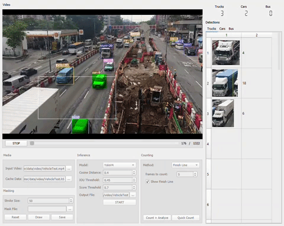
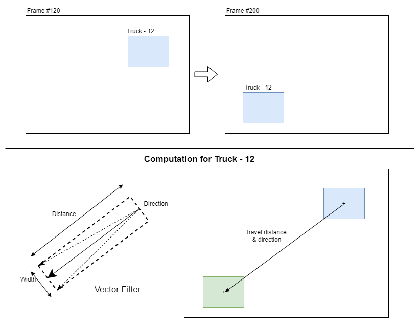
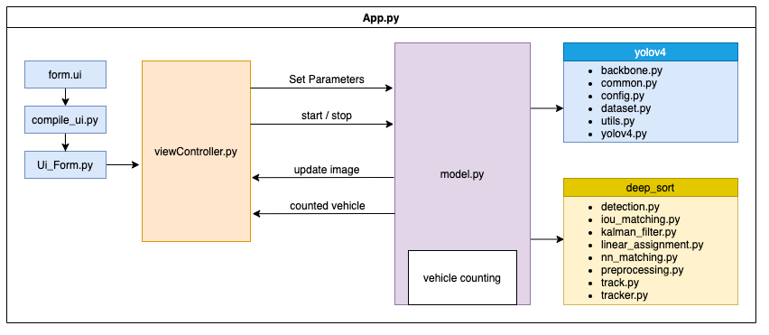
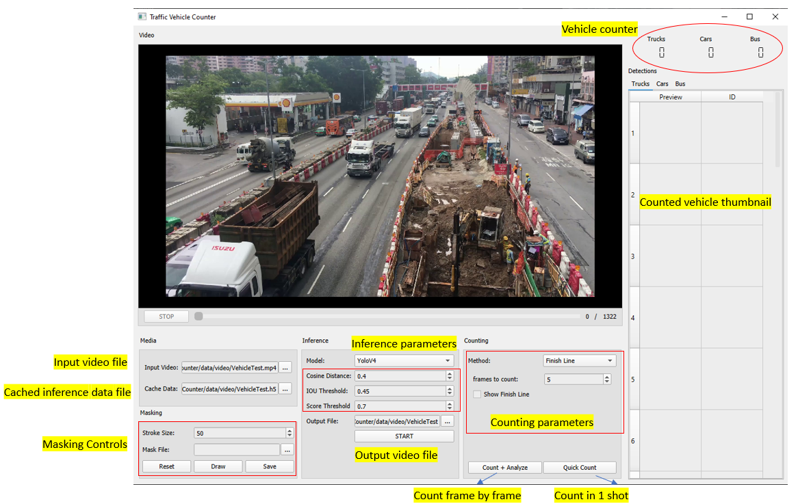
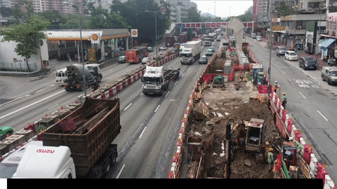
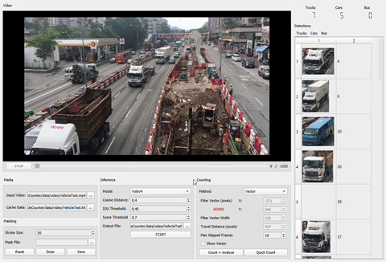
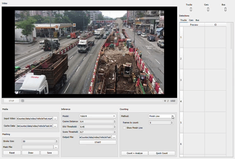

# **<div align='center'> Traffic Vehicle Counter </div>**  


# Description  

This is a software written in python for use in counting vehicles from a pre-recorded traffic camera video.

Demo video:
https://drive.google.com/file/d/1GImSkQ2CWaAPqje9_UJGZ80fDWFxbJfV/view

<br/><br/>

# Technologies Used
## Overview
Instead of hardcoding and relying on scripts to get the job done, a GUI is preferred to make the tool easier to optimize and adapt to different scenarios of counting vehicles by using interactive graphical handles.  

## Algorithm


### YOLOv4
---
YoloV4 deep learning based object detection model is used for its good balance between accuracy and inference speed.  
A pretrained model on MS COCO dataset allows easy vehicle detection  

##### YoloV4 explaination: https://becominghuman.ai/explaining-yolov4-a-one-stage-detector-cdac0826cbd7
<br></br>

### DeepSORT
---
DeepSORT is a popular object detection algorithm that fuses Kalman filters & deep learning to identify and track object movement from frame to frame

##### DeepSORT explaination: https://nanonets.com/blog/object-tracking-deepsort/
<br></br>
YoloV4 and DeepSORT code are taken from: https://github.com/theAIGuysCode/yolov4-deepsort 

### Vehicle Counting
---
#### **Finish Line Detection**
  
A rectangle region of interest (ROI) is defined, such that when the centroid of the detection bounding box is present in the ROI for more than X frames, the vehicle is counted  
### [Logical flow chart](docs/diagrams-finish_line.png)
<br></br>

#### **Travel Vector Filtering**
  
A vector is defined with the following:
- Direction (travel direction of vehicle)
- Magnitude (pixels traveled by vehicle)
- width (tolerance of travel direction)

For each detection, the travel and direction is computed and filtered out based on the vector defined above. 

The detection that passes the filter will be counted  


### [Logical flow chart](docs/diagrams-travel_vector.png)
<br></br>

## Software Architecture


### Notable frameworks and libraries used
---
1. Python 3.8
2. Pyside (Qt for Python)
3. Tensorflow
4. pyqtgraph

### GUI
---
The GUI is designed with Qt designer, which is a drag and drop tool to arrange the components and skeleton of the application. The designer files are saved in a `.ui` format, which needs to be converted to a python file  by `compile_ui.py`

`viewController.py` manages all user interaction behaviour and displays the content accordingly

### Backend
---
`model.py` encapsulates all the backend processing functionality and runs in a separate thread. 
<br></br>

# Usage


- When performing inference for the first time after software startup, expect to take ~1 minute for loading the model to GPU.
- Inference will also save the results to a hdf `.h5` file that can be used for offline analysis, because inference requires a lot of computing power
- The hdf file save location defaults to the same folder as the input video file
- Tweak the counting algorithms' parameters and visualize the results imediately by using the saved inferenced results in the hdf file

## Masking
- Masking tool allows certain fixed regions of the frame to be excluded from any detection.


## Setting up counting method
### Finish Line Method


### Travel Vector Method



# Setup & Installation
### Creating Conda Environment
```
conda env create -f conda-gpu.yml
conda activate trafficVehicleCounter-gpu
```  
### Downloading Official YOLOv4 Pre-trained SavedModel
Save the checkpointsfolder to the root of the repo  
https://drive.google.com/drive/folders/1f4NAGjFsVDrGNAJ52UX36LousG3tCsiA?usp=sharing

### Run the Application
```
python run.py
```

### Edit the designer file
```
designer
```
### Convert designer .ui file to .py file
```
python compile_ui.py
```

# Future Improvements
1. Training on actual data to better differentiate between vehicles
2. Tuning of DeepSORT parameters for more accurate tracking, right now duplicate IDs will occur when video has too many vehicles that look similar
3. Decouple the algorithms from PySide, encapsulate them as APIs
4. Saving settings into a project file
