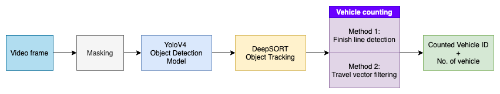

# **
 Traffic Vehicle Counter 
**

//GIF

# Description

This is a software written in python for use in counting vehicles from a pre-recorded traffic camera video.
  

# Technology
## Overview
Instead of hardcoding and relying on scripts to get the job done, a GUI is preferred to make the tool easier to use and adapt to different scenarios of counting vehicles by using interactive graphical handles.

### Notable frameworks and libraries used
1. Python 3.8
2. Pyside (Qt for Python)
3. Tensorflow
4. pyqtgraph

### Overview of algorithm

YoloV4 deep learning based object detection model is used for its good balance between accuracy and inference speed.  
A pretrained model on MS COCO dataset allows easy vehicle detection  

Link to YoloV4 explaination: https://becominghuman.ai/explaining-yolov4-a-one-stage-detector-cdac0826cbd7

DeepSORT is an object detection algorithm that combines 

Link to DeepSORT explaination: https://nanonets.com/blog/object-tracking-deepsort/

# Getting Started
## Prerequisites
If using Windows, please install K-Lite codec, because mp4 codecs are lacking by default on the Qt media framework.

https://www.codecguide.com/download_k-lite_codec_pack_basic.htm

## Creating Conda Environment
