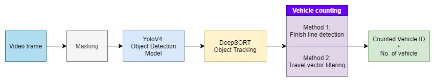
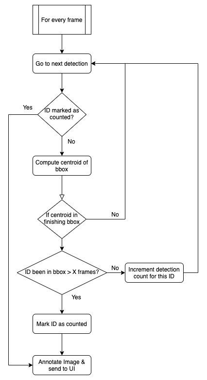

# **
 Traffic Vehicle Counter 
**

//GIF

# Description

This is a software written in python for use in counting vehicles from a pre-recorded traffic camera video.
  

# Technologies Used
## Overview
Instead of hardcoding and relying on scripts to get the job done, a GUI is preferred to make the tool easier to optimize and adapt to different scenarios of counting vehicles by using interactive graphical handles.

## Algorithm

### YOLOv4
---
YoloV4 deep learning based object detection model is used for its good balance between accuracy and inference speed.  
A pretrained model on MS COCO dataset allows easy vehicle detection  

##### YoloV4 explaination: https://becominghuman.ai/explaining-yolov4-a-one-stage-detector-cdac0826cbd7
  

### DeepSORT
---
DeepSORT is a popular object detection algorithm that fuses Kalman filters & deep learning to identify and track object movement from frame to frame

##### DeepSORT explaination: https://nanonets.com/blog/object-tracking-deepsort/
  
YoloV4 and DeepSORT code are taken from: https://github.com/theAIGuysCode/yolov4-deepsort 

### Vehicle Counting
---
#### **Finish Line Detection**

#### Travel Vector Filtering

## Software Architecture

### Notable frameworks and libraries used
---
1. Python 3.8
2. Pyside (Qt for Python)
3. Tensorflow
4. pyqtgraph

### GUI
---
The GUI is designed with Qt designer, which is a drag and drop tool to arrange the components and skeleton of the application. The designer files are saved in a `.ui` format, which needs to be converted to a python file  by `compile_ui.py`

`viewController.py` manages all user interaction behaviour and displays the content accordingly

### Backend
---
`model.py` encapsulates all the backend processing functionality and runs in a separate thread. 

# Usage
## Masking
- Masking tool allows certain fixed regions of the frame to be excluded from any detection.

## Inference
- Performing inference will also save the results to a hdf `.h5` file that can be used for offline analysis, because inference requires a lot of computing power
- The hdf file save location defaults to the same folder as the input video file

// GIF

## Offline Analysis
- Tweak the counting algorithms' parameters and visualize the results imediately by using the saved inferenced results in the hdf file

//GIF

# Setup & Installation
## Prerequisites
If using Windows, please install K-Lite codec, because mp4 codecs are lacking by default on the Qt media framework.

https://www.codecguide.com/download_k-lite_codec_pack_basic.htm

## Creating Conda Environment

# Future Improvements

# References